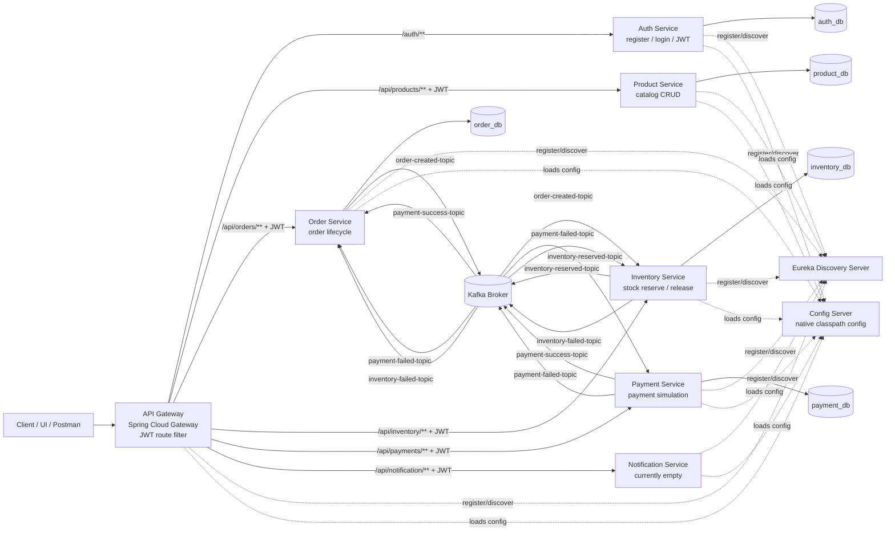
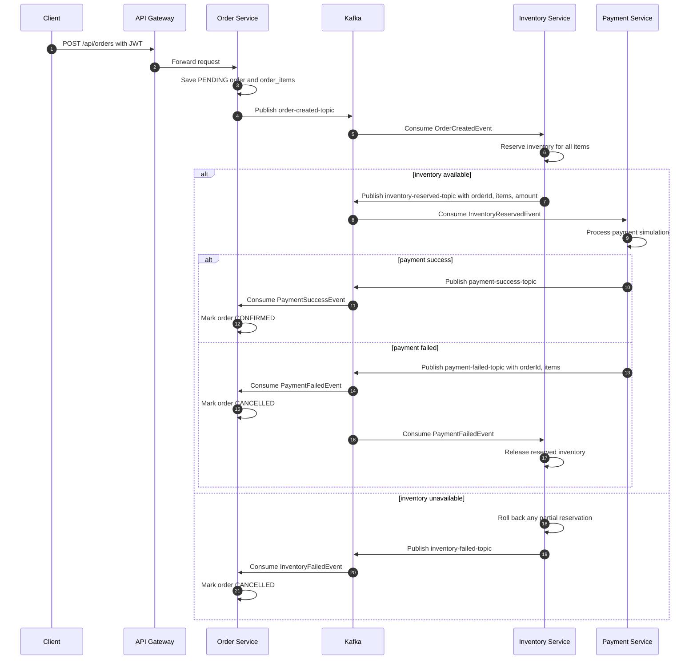
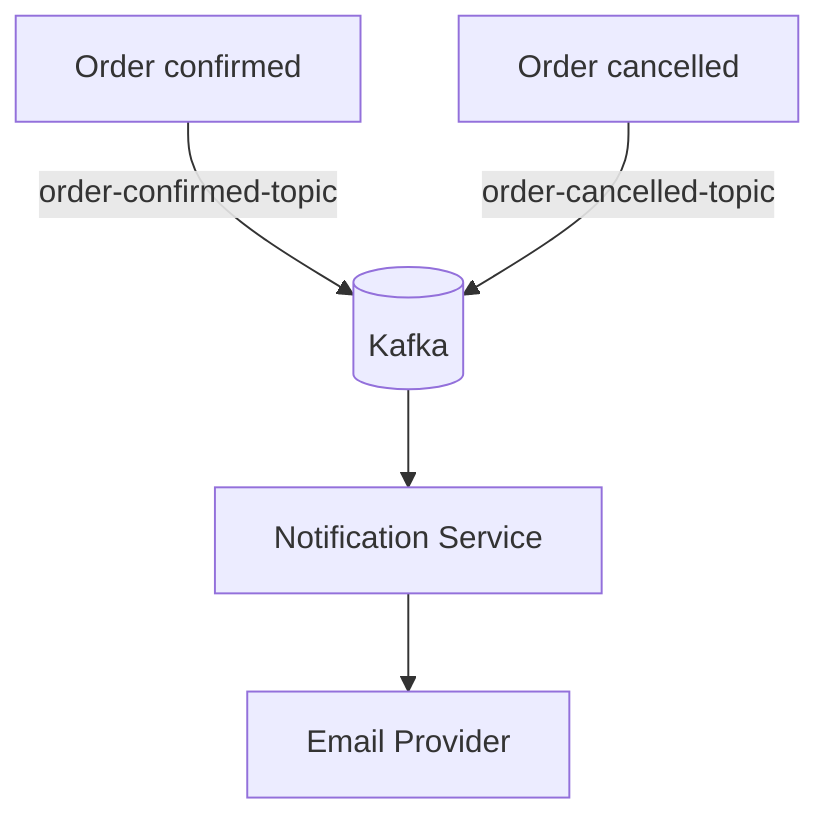

# E-Commerce Microservices Flow and Concept Gap Analysis

## Scope

This document reviews the current workspace implementation against the microservice concepts described in the chat notes and the existing architecture blueprint.

Reviewed modules:

- discovery-server
- config-server
- api-gateway
- auth-service
- product-service
- inventory-service
- order-service
- payment-service
- notification-service

## Current High-Level Architecture



## Current Saga Flow



## Current Module Status

| Module | Current status | Evidence | Main gaps |
|---|---|---|---|
| discovery-server | Implemented basic Eureka server | `@EnableEurekaServer` | No security, HA clustering, or container health setup |
| config-server | Implemented native config server | `spring.cloud.config.server.native.search-locations=classpath:/config` | No Git-backed config profile, encryption, refresh bus, or secrets strategy |
| api-gateway | Implemented basic routing and JWT route filter | Gateway routes and `JwtAuthenticationFilterGatewayFilterFactory` | No rate limiter, circuit breaker, retries, fallback routes, request correlation, or CORS policy |
| auth-service | Implemented basic register/login/JWT | Auth controller, JWT service, user repository | No refresh tokens, token revocation, role claims in JWT, endpoint validation, duplicate user handling, or OAuth2/Keycloak |
| product-service | Implemented basic CRUD | Product entity, controller, service, repository | No update endpoint, search/filtering, cache, validation, or inventory synchronization |
| order-service | Implemented order creation and saga event consumers | Creates order, publishes order-created, handles payment/inventory failures | No idempotency, outbox, order query endpoints, validation, DLQ handling, or optimistic locking |
| inventory-service | Implemented reserve/release and saga event handling | Consumes order-created/payment-failed, publishes inventory-reserved/failed | No idempotency, concurrency protection, outbox, validation, or inventory confirmation step |
| payment-service | Implemented payment entity and simulated payment | Consumes inventory-reserved, publishes success/failure | Random success/failure only, no external provider, no idempotency, no retries, no provider timeout handling |
| notification-service | Module exists but not implemented | Only application class exists | Needs Kafka consumers, mail sender/service, templates, retry/DLQ, notification audit |

## Concept Coverage Matrix

| Concept | Current state | Where it belongs | Recommended implementation |
|---|---|---|---|
| API Gateway | Present | api-gateway | Keep all external routing here; add gateway-level resilience, throttling, CORS, and request correlation |
| JWT authentication | Partially present | auth-service and api-gateway | Auth issues tokens; gateway validates tokens; downstream services can trust gateway or validate method-level roles |
| Eureka discovery | Present | discovery-server plus all services | Already included; add health checks and consider multiple Eureka nodes for production |
| Config server | Present | config-server plus all services | Already wired; add config encryption and secret externalization |
| Database per service | Mostly present | auth/product/order/inventory/payment | Keep separate DBs; add Flyway/Liquibase migrations |
| Kafka event-driven flow | Present for saga | order/inventory/payment | Add JSON serializer/deserializer config, consumer groups, retries, DLQs, and schema/version strategy |
| Saga choreography | Present | order/inventory/payment | Add idempotency, outbox pattern, retry/DLQ, and event status tracking |
| Compensation transaction | Present for payment/inventory failure | order-service and inventory-service | Payment failure cancels order and releases inventory; inventory failure cancels order |
| Circuit breaker | Missing | api-gateway, REST clients, external payment provider | Add Resilience4j circuit breakers for gateway routes and any synchronous service calls |
| Retry pattern | Missing | Kafka consumers, external calls, gateway routes | Use Kafka retry/DLQ for async; Resilience4j retry for transient synchronous calls |
| Rate limiting | Missing | api-gateway | Use Spring Cloud Gateway RedisRateLimiter or Bucket4j |
| Bulkhead | Missing | payment-service, notification-service, gateway | Use Resilience4j bulkhead/thread-pool bulkhead around payment provider and mail sender |
| Timeout | Missing | gateway, external provider calls, REST clients | Configure gateway HTTP client timeouts and WebClient/RestClient timeouts |
| Fallback | Missing | api-gateway and external calls | Add route fallback endpoints for unavailable services where useful |
| Idempotency | Missing | order/inventory/payment Kafka consumers and order creation | Store processed event IDs or idempotency keys; prevent duplicate reservation/payment |
| Outbox pattern | Missing | order/inventory/payment | Persist events in same DB transaction and publish asynchronously |
| Dead letter queue | Missing | Kafka consumers | Add retry topics and `.DLT` handlers for failed events |
| Distributed tracing | Missing | all modules | Add Micrometer Tracing and Zipkin/OTel exporter |
| Centralized logging | Missing | all modules | Add trace IDs to logs and ship logs to ELK/OpenSearch/Loki |
| Metrics and monitoring | Partial | all modules | Actuator exists; add Prometheus registry and dashboards |
| OpenAPI documentation | Missing | all API services | Add springdoc-openapi to gateway or each service |
| Validation | Partial/missing | controllers and DTOs | Add `@Valid`, bean constraints, and global exception handlers |
| Security authorization | Partial/missing | gateway and services | Add roles/claims, method security, admin-only product/inventory writes |
| Secrets management | Missing | config-server, deployment | Move DB passwords/JWT secret out of source into environment variables or Vault |
| Containerization | Missing | repo root and modules | Add Dockerfiles and docker-compose for Postgres, Kafka, Eureka, Config, services |
| CI/CD | Missing | repo root | Add build/test workflow and container publishing |
| Kubernetes readiness | Missing | deployment manifests | Add probes, ConfigMaps, Secrets, HPA, and Ingress/Gateway |

## Where Missing Concepts Should Go

### API Gateway

Add these concepts here:

- JWT validation for protected routes: already present.
- Auth route bypass: already present for `/auth/**`.
- Rate limiting: protect public APIs from burst traffic.
- Route circuit breakers: prevent slow/down services from consuming gateway resources.
- Gateway retries: only for idempotent reads, not order creation/payment mutation.
- Request timeout: stop waiting forever on downstream services.
- CORS policy: if a browser frontend will call the gateway.
- Request correlation ID: generate or propagate `X-Correlation-Id`.

Recommended dependencies:

```xml
<dependency>
    <groupId>org.springframework.cloud</groupId>
    <artifactId>spring-cloud-starter-circuitbreaker-reactor-resilience4j</artifactId>
</dependency>
<dependency>
    <groupId>org.springframework.boot</groupId>
    <artifactId>spring-boot-starter-data-redis-reactive</artifactId>
</dependency>
```

Recommended route placement:

```yaml
spring:
  cloud:
    gateway:
      routes:
        - id: order-service
          uri: lb://ORDER-SERVICE
          predicates:
            - Path=/api/orders/**
          filters:
            - JwtAuthenticationFilter
            - name: CircuitBreaker
              args:
                name: orderServiceCircuitBreaker
                fallbackUri: forward:/fallback/orders
            - name: RequestRateLimiter
              args:
                redis-rate-limiter.replenishRate: 20
                redis-rate-limiter.burstCapacity: 40
```

### Auth Service

Add these concepts here:

- Duplicate username/email validation.
- Password policy validation.
- Role claims inside JWT.
- Refresh token support.
- Token expiration configuration from config-server.
- Global exception handler.
- Optional Keycloak/OAuth2 migration later.

### Product Service

Add these concepts here:

- Bean validation for product create/update.
- Product update endpoint.
- Search/filter endpoint.
- Cache read-heavy product catalog with Redis.
- Admin authorization for write operations.
- OpenAPI docs.

### Order Service

Add these concepts here:

- Idempotency key for `POST /api/orders`.
- Outbox table for reliable `order-created-topic` publishing.
- Query endpoints for order status/history.
- Kafka consumer idempotency for `payment-success`, `payment-failed`, `inventory-failed`.
- DLQ handler for failed saga events.
- Validation for request items.
- Optional state transition guard: do not confirm a cancelled order or cancel a confirmed order.

Important placement:

- Circuit breaker is not needed for the current Kafka-based saga path because no synchronous downstream service call is made.
- If order-service later calls product-service or user-service synchronously, put circuit breaker/retry/timeouts on those clients.

### Inventory Service

Add these concepts here:

- Idempotent reservation and release by `orderId`.
- Optimistic locking on inventory rows to avoid overselling.
- Outbox table for `inventory-reserved-topic` and `inventory-failed-topic`.
- DLQ handler for failed `order-created-topic` and `payment-failed-topic` messages.
- Validation for negative stock and negative release.
- Optional inventory confirmation after payment success if reserved stock should become sold stock.

### Payment Service

Add these concepts here:

- Real provider integration behind an adapter: Stripe/Razorpay/etc.
- Circuit breaker, retry, timeout, and bulkhead around the external provider call.
- Idempotency by `orderId` or payment request ID.
- Outbox table for `payment-success-topic` and `payment-failed-topic`.
- DLQ handler for failed `inventory-reserved-topic` messages.
- Do not use random success/failure outside demos.

Recommended placement:

```java
@CircuitBreaker(name = "paymentProvider", fallbackMethod = "paymentFallback")
@Retry(name = "paymentProvider")
@TimeLimiter(name = "paymentProvider")
public PaymentResult charge(...) {
    // external provider call
}
```

### Notification Service

This is currently the largest missing module.

Add these concepts here:

- Kafka consumers for `payment-success-topic`, `payment-failed-topic`, and optionally `inventory-failed-topic`.
- Email sending service using `JavaMailSender`.
- Notification templates.
- Retry and DLQ for failed email sends.
- Notification audit table if delivery state must be tracked.
- Bulkhead around mail sending so it cannot exhaust service threads.

Recommended consumers:

```text
payment-success-topic -> send order confirmation email
payment-failed-topic  -> send payment failure / order cancelled email
inventory-failed-topic -> send out-of-stock / order cancelled email
```

### Config Server

Add these concepts here:

- Keep native config for local development.
- Add Git-backed profile for shared environments.
- Encrypt secrets or move them to Vault/environment variables.
- Add Spring Cloud Bus if runtime config refresh is required.

### Discovery Server

Add these concepts here:

- For local development, one Eureka server is enough.
- For production, run more than one Eureka node.
- Add health checks and deployment probes.

## Current Event Topics

| Topic | Producer | Consumer | Implemented |
|---|---|---|---|
| order-created-topic | order-service | inventory-service | Yes |
| inventory-reserved-topic | inventory-service | payment-service | Yes |
| inventory-failed-topic | inventory-service | order-service | Yes |
| payment-success-topic | payment-service | order-service | Yes |
| payment-failed-topic | payment-service | order-service, inventory-service | Yes |
| order-confirmed-topic | none | notification-service | No |
| order-cancelled-topic | none | notification-service | No |

## Suggested Target Flow With Notification



The current code does not publish `order-confirmed-topic` or `order-cancelled-topic`. Notification could consume existing `payment-success-topic`, `payment-failed-topic`, and `inventory-failed-topic`, but explicit order lifecycle topics are cleaner.

## Recommended Implementation Priority

| Priority | Work item | Reason |
|---|---|---|
| P0 | Add Maven wrapper or install Maven | Needed to compile and verify the workspace consistently |
| P0 | Add Kafka JSON serializer/deserializer config | Current object events may fail at runtime without this |
| P0 | Implement notification-service | Required module is currently empty |
| P1 | Add validation and exception handling | Prevent bad requests and improve API behavior |
| P1 | Add idempotency to saga consumers | Kafka can deliver duplicate messages |
| P1 | Add outbox pattern | Prevent DB commit/event publish inconsistency |
| P1 | Add DLQ/retry topics | Prevent poison messages from blocking consumers |
| P2 | Add gateway rate limiting | Protect public APIs |
| P2 | Add circuit breakers/timeouts | Needed for gateway routes and external provider calls |
| P2 | Add tracing and metrics | Needed for debugging distributed flows |
| P3 | Add Docker Compose | Needed for repeatable local environment |
| P3 | Add CI/CD and Kubernetes manifests | Needed for deployment maturity |

## Most Important Missing Concepts

### 1. Kafka Reliability

The code uses Kafka, but production reliability is not complete without:

- JSON serializer/deserializer configuration.
- Consumer group IDs.
- Retry topics.
- Dead letter topics.
- Idempotent consumers.
- Event schema/versioning.

This belongs in `order-service`, `inventory-service`, `payment-service`, and `notification-service`.

### 2. Outbox Pattern

The current services save DB state and publish Kafka messages directly from service logic. This can fail between database commit and event publish.

Use outbox tables in:

- order-service for `order-created-topic`
- inventory-service for `inventory-reserved-topic` and `inventory-failed-topic`
- payment-service for `payment-success-topic` and `payment-failed-topic`

### 3. Circuit Breaker

Circuit breaker is currently missing.

Best placement:

- API Gateway route circuit breakers for downstream service availability.
- Payment Service around external payment provider calls.
- Notification Service around mail provider calls.
- Any future synchronous service-to-service client.

Circuit breaker is less relevant inside the existing Kafka choreography itself because Kafka decouples producer and consumer availability.

### 4. Rate Limiting

Rate limiting is currently missing.

Best placement:

- API Gateway, per route and/or per user/IP.
- Optionally stricter limits on auth login/register to reduce brute-force risk.

### 5. Observability

Actuator dependencies exist in most modules, but observability is incomplete.

Add:

- Micrometer Prometheus registry.
- Micrometer Tracing with OpenTelemetry/Zipkin.
- Correlation ID propagation through gateway and Kafka headers.
- Centralized logs with trace IDs.

## Current Completion Summary

| Area | Completion |
|---|---|
| Module skeletons | Complete |
| Basic service discovery | Complete |
| Basic config server | Complete |
| Gateway routing | Mostly complete |
| JWT auth | Basic implementation complete |
| Product CRUD | Basic implementation complete |
| Order saga | Basic implementation complete |
| Inventory compensation | Basic implementation complete |
| Payment flow | Demo implementation complete |
| Notification service | Missing |
| Kafka production hardening | Missing |
| Circuit breaker/retry/rate limit | Missing |
| Observability | Missing |
| Tests | Missing |
| Docker/Kubernetes/CI | Missing |

## Final Assessment

The project currently demonstrates the core learning concepts of a Spring Boot microservices e-commerce system:

- API Gateway
- JWT authentication
- Eureka service discovery
- Config server
- Database per service
- Kafka-based saga choreography
- Compensation for payment and inventory failure

It is not yet production-grade. The largest remaining gaps are notification-service implementation, Kafka reliability, idempotency, outbox pattern, circuit breakers, rate limiting, observability, tests, and repeatable infrastructure.
